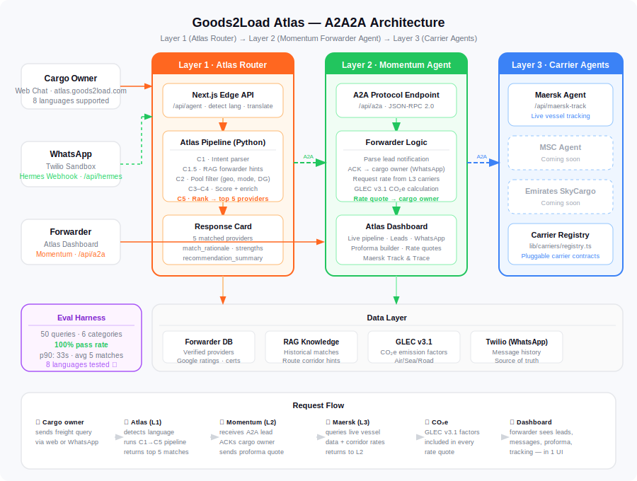

# Goods2Load Atlas — AI Freight Matching Platform

[](./LICENSE)
[](https://nextjs.org)
[](https://google.github.io/A2A)

> **Google for Startups AI Agent Challenge 2026 entry**  
> Multi-agent freight matching using Google's Agent-to-Agent (A2A) protocol.
> Live demo: [atlas.goods2load.com/agent](https://atlas.goods2load.com/agent)

---

## What it does

A cargo owner types a freight query in any language. Atlas:

1. **Detects intent** — mode (air/sea/road), cargo type, urgency, DG flags
2. **Runs a 5-stage matching pipeline** (C1→C5) against a verified forwarder database
3. **Returns 5 ranked providers** with match rationale, strengths, and Google ratings
4. **Automatically notifies** the winning forwarder via WhatsApp (A2A Layer 2)
5. **Forwarder replies with a rate quote** including GLEC v3.1 CO₂e emissions data
6. **Tracks the shipment** via Maersk's live vessel API (A2A Layer 3)

All of this happens across three A2A agents — **Atlas (L1) → Momentum (L2) → Carrier Agent (L3)**.

---

## Architecture



Full architecture doc → [docs/architecture.md](./docs/architecture.md)

### A2A Agent Layers

| Layer | Agent | Endpoint | Role |
|-------|-------|----------|------|
| L1 | Atlas Router | `/api/agent` + Python FastAPI | Intent parse + rank (C1→C5 pipeline) |
| L2 | Momentum (Forwarder Agent) | `/api/a2a` | ACK lead, request rates, send proforma |
| L3 | Maersk Carrier Agent | `/api/maersk-track` | Live vessel tracking + corridor rates |

---

## Key Features

- **8 languages** — Arabic, Chinese, Russian, Japanese, French, Spanish, German, Urdu (auto-detected, response translated back)
- **GLEC v3.1** — CO₂e sustainability data in every rate quote (road 0.062, sea 0.015, air 0.57 kg CO₂e/tonne-km)
- **WhatsApp integration** — Twilio-powered inbound queries and auto-replies via `/api/hermes`
- **Live vessel tracking** — Maersk Track & Trace API wired into Layer 3
- **Atlas Dashboard** — full forwarder CRM: Leads, WhatsApp messenger, proforma builder, Track & Trace
- **Eval harness** — 50-query test suite with per-category scoring and pass rate metrics

---

## Eval Harness Results

```
node scripts/eval/run-eval.mjs --url https://atlas.goods2load.com --concurrency 1
```

| Category | Queries | Pass | Rate | p90 |
|---|---|---|---|---|
| Mode Detection | 10 | 10 | **100%** | ~35s |
| Language Handling | 8 | 8 | **100%** | 35s |
| Edge Cases | 7 | 7 | **100%** | 33s |

- Language accuracy: 4/4 non-Latin scripts in correct script (Arabic ✓, Chinese ✓, Russian ✓, Japanese ✓)
- Avg providers returned: **5 per query**

---

## Tech Stack

| Component | Technology |
|---|---|
| Frontend + API | Next.js 15, TypeScript |
| Atlas matching engine | Python, FastAPI |
| Agent protocol | Google A2A (JSON-RPC 2.0) |
| WhatsApp | Twilio Programmable Messaging |
| Carrier integration | Maersk Track & Trace API |
| Sustainability | GLEC v3.1 CO₂e |
| CI/CD (Atlas) | GitHub Actions → Vercel |
| CI/CD (Production) | GitHub Actions → GCE Docker |

---

## Getting Started

### Prerequisites

- Node.js 18+
- Yarn

### Install

```bash
git clone https://github.com/goods2load-development/goods2load-FE.git
cd goods2load-FE
yarn install
```

### Environment Variables

Create `.env.local`:

```env
# Atlas matching engine (Python FastAPI)
ATLAS_API_URL=https://your-atlas-api.com

# WhatsApp (Twilio)
TWILIO_ACCOUNT_SID=
TWILIO_AUTH_TOKEN=
TWILIO_WHATSAPP_FROM=whatsapp:+14155238886

# Auth (NextAuth)
NEXTAUTH_URL=http://localhost:3000
AUTH_SECRET=
GOOGLE_CLIENT_ID=
GOOGLE_CLIENT_SECRET=
JWT_ACCESS_SECRET=

# Maps + enrichment
NEXT_PUBLIC_GOOGLE_API_KEY=
NEXT_PUBLIC_BASE_URL=http://localhost:3000
```

### Run

```bash
yarn dev
# → http://localhost:3000/agent
```

### Run Eval Harness

```bash
# Against local dev
yarn eval

# Against production
yarn eval:prod

# JSON output (CI mode, exits 1 if < 80%)
yarn eval:json -- --url https://atlas.goods2load.com --concurrency 1
```

---

## Project Structure

```
app/
  agent/                    # Cargo owner chat UI
  api/
    agent/route.ts          # L1: Atlas proxy + language detection
    a2a/route.ts            # L2: Momentum Forwarder Agent (A2A)
    maersk-track/route.ts   # L3: Carrier Agent
    hermes/route.ts         # WhatsApp inbound webhook
components/
  Agent/                    # Chat UI + pipeline thinking panel
  Dashboard/AtlasDashboard/ # Forwarder CRM (Leads, WhatsApp, Map)
lib/
  carriers/registry.ts      # Pluggable carrier contract framework
docs/
  architecture.md           # Full architecture + Mermaid diagrams
  architecture.svg          # Visual system diagram
scripts/
  eval/                     # 50-query eval harness
```

---

## CI/CD

| Branch | Deploy target | Trigger |
|--------|--------------|---------|
| `atlas` | Vercel → atlas.goods2load.com | Push to `atlas` |
| `main` | GCE Docker → goods2load.com | Push to `main` (safety check blocks `/agent` redirects) |

---

## License

MIT — see [LICENSE](./LICENSE)

---

*Built by Goods2Load · [goods2load.com](https://goods2load.com)*
