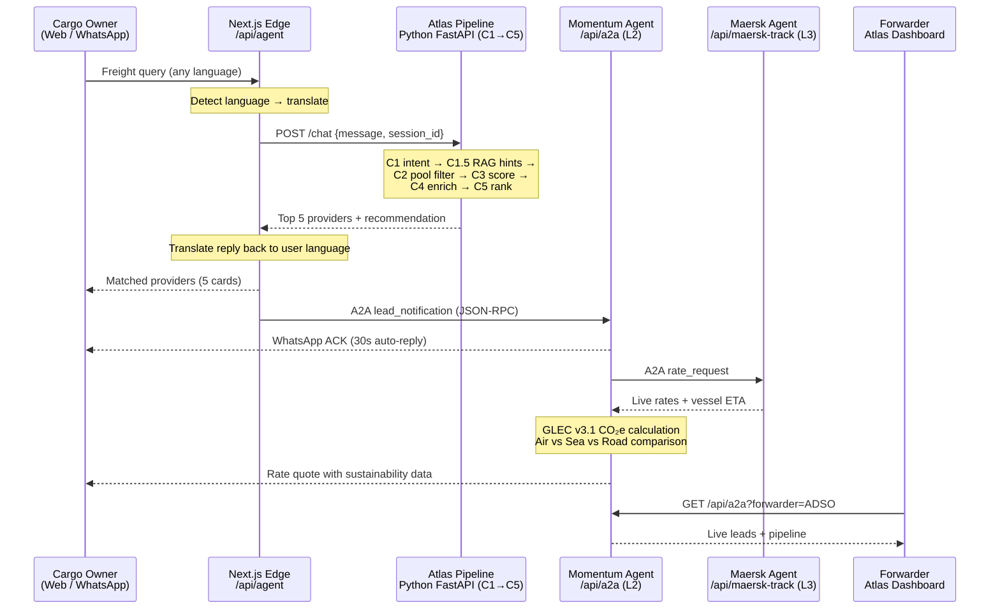

# Goods2Load Atlas — Architecture

## A2A2A Multi-Agent Pipeline

Atlas implements Google's **Agent-to-Agent (A2A) protocol** across three layers:

| Layer | Agent | Endpoint | Role |
|-------|-------|----------|------|
| L1 | Atlas Router | `/api/agent` + Python FastAPI | Parse intent, rank forwarders (C1→C5) |
| L2 | Momentum (Forwarder Agent) | `/api/a2a` | ACK lead, request rates, send proforma |
| L3 | Carrier Agents | `/api/maersk-track` | Live vessel tracking + corridor rates |

---

## System Diagram


---

## Request Flow



---

## Component Map

```mermaid
graph TB
    subgraph Inputs
        WEB[Web Chat<br/>atlas.goods2load.com/agent]
        WA[WhatsApp<br/>Twilio Sandbox]
        DB[Forwarder Dashboard<br/>atlas.goods2load.com/dashboard]
    end

    subgraph "L1 · Atlas Router (Next.js + Python)"
        API[/api/agent<br/>Language detection + translation]
        C1[C1 · Intent Parser<br/>mode / cargo / route / urgency]
        C15[C1.5 · RAG<br/>Historical forwarder hints]
        C2[C2 · Pool Filter<br/>geo · mode · DG · certifications]
        C3C4[C3-C4 · Score + Enrich<br/>verification · Google rating · web]
        C5[C5 · Ranker<br/>Top 5 providers + rationale]
        API --> C1 --> C15 --> C2 --> C3C4 --> C5
    end

    subgraph "L2 · Momentum Agent (/api/a2a)"
        ACK[Lead ACK<br/>30s auto-reply to cargo owner]
        RATE[Rate Builder<br/>GLEC v3.1 CO₂e + proforma]
        DASH[Atlas Dashboard<br/>Leads · WhatsApp · Track]
    end

    subgraph "L3 · Carrier Agents"
        MAERSK[Maersk Agent<br/>/api/maersk-track]
        MSC[MSC Agent<br/>coming soon]
        EK[Emirates SkyCargo<br/>coming soon]
    end

    subgraph "Data"
        FWDB[(Forwarder DB<br/>verified · rated · certified)]
        RAGDB[(RAG Store<br/>route corridors)]
        GLEC[(GLEC v3.1<br/>CO₂e factors)]
        TWILIO[(Twilio<br/>message history)]
    end

    WEB --> API
    WA -->|/api/hermes| API
    DB --> ACK

    C5 -->|A2A lead_notification| ACK
    ACK --> RATE
    RATE -->|A2A rate_request| MAERSK
    MAERSK --> RATE
    RATE --> DASH

    C15 --> RAGDB
    C2 --> FWDB
    RATE --> GLEC
    ACK --> TWILIO
```

---

## Eval Harness Results (Baseline · 2026-05-29)

Run against `https://atlas.goods2load.com/api/agent`, sequential (concurrency=1):

| Category | Queries | Pass | Rate | p90 |
|---|---|---|---|---|
| Mode Detection | 10 | 10 | **100%** | ~35s |
| Language Handling | 8 | 8 | **100%** | 35s |
| Edge Cases | 7 | 7 | **100%** | 33s |
| Specialty Cargo | 8 | TBD | — | — |
| Route Variety | 12 | TBD | — | — |
| Conversation | 5 | TBD | — | — |

- **Language accuracy:** 4/4 non-Latin scripts returned in correct script (Arabic ✓, Chinese ✓, Russian ✓, Japanese ✓)
- **Avg providers returned:** 5 per query
- **Known gap:** concurrent requests time out — Atlas Python backend runs single-threaded; fix: `uvicorn --workers 4`

Run the harness: `node scripts/eval/run-eval.mjs --url https://atlas.goods2load.com --concurrency 1`

---

## Tech Stack

| Component | Technology |
|---|---|
| Frontend + API layer | Next.js 15, TypeScript, Vercel |
| Atlas matching engine | Python, FastAPI, custom ranker |
| Agent protocol | Google A2A (JSON-RPC 2.0) |
| WhatsApp integration | Twilio Programmable Messaging |
| Carrier integration | Maersk Track & Trace API |
| Sustainability | GLEC v3.1 CO₂e (road 0.062, sea 0.015, air 0.57 kg/t-km) |
| Eval harness | Node.js, 50-query test suite |
| CI/CD | GitHub Actions → Vercel (atlas) / GCE Docker (production) |
